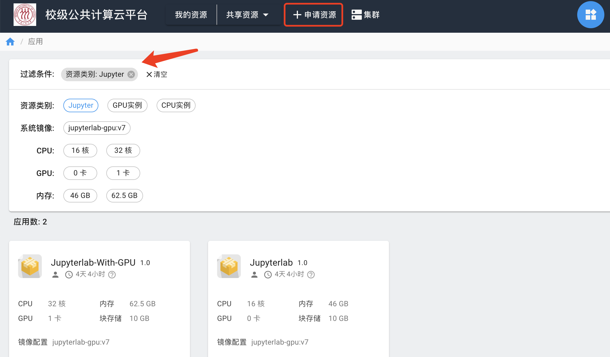
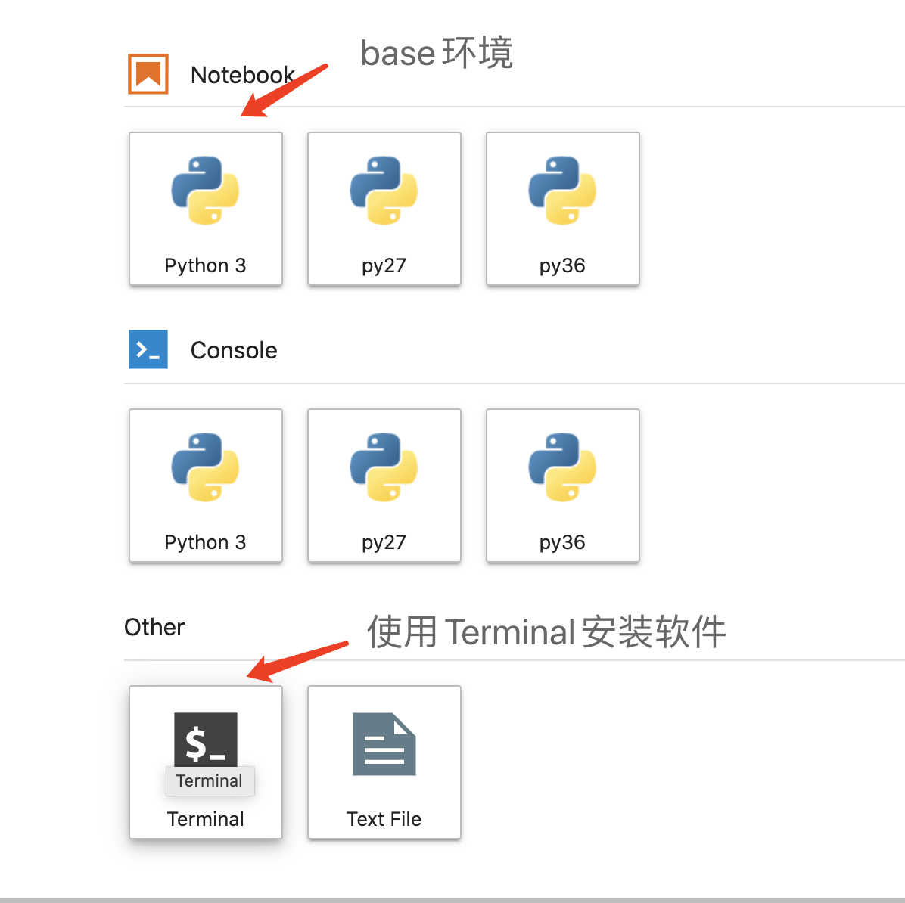
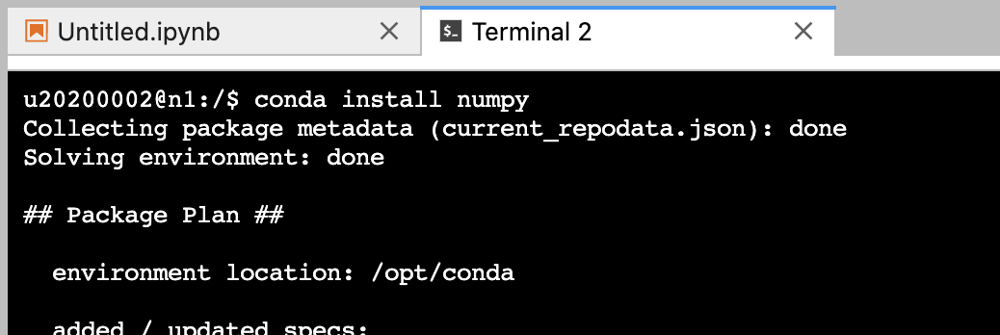

# JupyterLab GPU

JupyterLab是下一代Jupyter Notebook，它集成了更多功能，是一个集成开发环境。

## 申请实例

JupyterLab属于交互实例，在计算云上使用时，需要先申请资源。首先点击“申请资源”，然后在所有应用中过滤出Jupyter。我们准备了CPU版和GPU版的镜像，用户按需申请。



## 使用JupyterLab

启动好后，即可进入Jupyter交互界面。用户可以前往[JupyterLab的官方文档](https://jupyterlab.readthedocs.io/en/latest/)学习详细使用方法。


我们已经在实例中安装好了Anaconda，用户进入Jupyter后默认使用`/opt/conda/bin/`下的`conda`和`python`。其中，Python3为Anaconda`base`环境提供的Python。



如果用户希望安装自己的软件包，需要启动一个Terminal，在Terminal中使用`conda install`或`pip install`命令来安装所需软件包。

```
# 使用 conda 安装
conda install numpy

# 使用 pip 安装
pip install lightgbm
```

如下图所示：



安装好之后，我们就可以在Notebook中使用这些包了。
