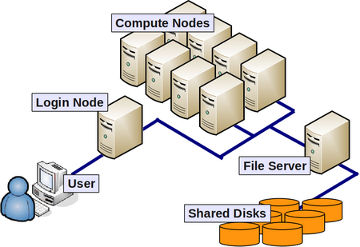

# 作业调度

## 共享集群简介

一个计算集群是由一组计算性能强劲的计算机通过高速网络连接后组成。集群中某单台计算机被称为节点（node）。高性能计算集群一般由登录节点、计算节点和存储节点组成。



用户需要先连接到登录节点，登录节点是连接整个集群的入口。用户通过登录节点来进一步访问计算节点和存储节点。计算节点，是提供计算服务的计算机节点，可以是CPU节点或GPU节点。通常情况下，一个用户作业任务需要一台或多台计算节点来支持其计算服务。将某个计算作业任务分配到不同计算节点上进行计算的工具被称为**作业调度系统**。计算作业一般需要读写文件，我们采用了**共享存储系统**，将存储节点的磁盘空间映射到所有计算节点上。共享存储的可用磁盘容量非常大，这样一个大容量的磁盘空间被映射到用户的目录上。映射后，用户可以像操作本地的文件一样操作远程的存储节点上的文件。

!!! note "调度器与队列"

    如果把向集群提交作业比作前往银行办理业务，那么作业调度器就是银行门口的取号机，用户需要排队，根据叫号来办理业务。用户一般需要告知取号机自己办理哪种服务，比如存取款的普通柜台、对公柜台、VIP柜台、理财顾问等等。取号机在相应的柜台服务上生成排队号码。调度器中的队列与之相似，用户在提交作业时，一般要告知调度器作业所属的队列，调度器会把用户作业放在该队列里排队。

    下图展示了作业通过调取器来排队的情况。queue A和queue B是两个队列，某个作业会在这两个队列中排队并执行，两个队列里的作业互不干扰，不会互相占用资源。

    

常见的作业调度系统有Torque（我校2017年项目采用Torque）和Slurm（本项目采用）。Slurm（Simple Linux Utility for Resource Management）是一种可用于大型计算集群的作业调度系统，被世界范围内的超级计算机和计算集群广泛采用。相比Torque，Slurm更先进，因此我们放弃了Torque，转而使用Slurm。无论Torque还是Slurm，作业调度系统主要包括提交作业、查看状态等几大部分。下面将介绍如何使用Slurm来提交作业。

## 查看集群状态

我们可以使用`sinfo`查看集群信息和状态。

## 提交作业

在Slurm系统中，提交作业前需要先准备一个脚本，该脚本中会说明用户本次申请的资源。准备好脚本后，再使用`sbatch`提交作业。

```bash
#!/bin/bash
#SBATCH --nodes=1
#SBATCH --ntasks-per-node=32
#SBATCH --time=2:00:00
#SBATCH --job-name=JOBNAME

python test.py
```

