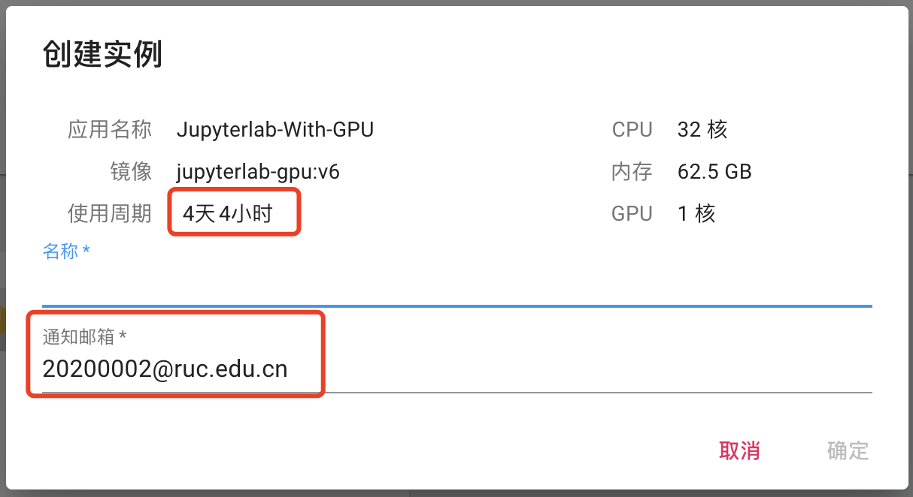

# 使用模式

!!! warning "资源多≠速度快"
    无论使用以下哪种方式申请计算资源，并不意味着申请的资源越多，计算速度就会越快。程序必须经过并行计算优化，才能取得更快的计算速度，比如，CPU程序要经过多核优化，GPU程序要利用CUDA加速。

## 模式对比

为了满足全校师生复杂多样的个性化计算需求，适应新型计算模式如人工智能训练等对运行环境的复杂要求，校级公共计算云平台的建设除了在硬件设备的选型上充分考虑了计算的多样性，提供了包含普通x86节点，x86胖节点（大内存）、2卡Tesla V100 GPU节点、2卡Titan RTX GPU节点、2卡GeForce 2080 Ti GPU节点，ARM节点等丰富算力组合，在软件平台的建设上也采用了区别于传统高性能计算中心的作业调度系统的解决方案，在不损失计算性能的前提下以灵活多样的方式提供服务。

|          | 共享集群                                                     | 交互实例                                                     | 虚拟机                                                       |
| -------- | ------------------------------------------------------------ | ------------------------------------------------------------ | ------------------------------------------------------------ |
| 适用人群 | 对Linux命令行和作业调度系统比较熟悉，计算量非常大。          | 不熟悉Linux，习惯交互式图形界面，计算量相对较小，使用图形界面快速实验验证一些想法。**无计算机背景的新用户建议使用这种模式。** | 熟悉Linux，有独占虚拟机进行计算的必要。                      |
| 应用类型 | 绝大多数计算任务                                             | Jupyter、RStudio、MATLAB等有交互界面的计算任务               | CentOS、Ubuntu系统                                           |
| 申请资源 | 编写资源申请脚本，使用作业调度软件提交作业                   | 在Web界面申请资源                                            | 在Web界面申请资源，使用Linux命令行或者VNC操作服务器          |
| 计费方式 | 从作业启动后开始计费，直到作业结束，作业结束后资源自动释放。 | 从启动计算资源开始计费，直到资源释放为止。有最长使用期限，超过最长使用期限后系统自动释放资源，用户也可以自己手动释放资源。 | 从启动计算资源开始计费，直到资源释放为止。有最长使用期限，超过最长使用期限后系统自动释放资源，用户也可以自己手动释放资源。最长使用期限可与管理员协商。 |
| 资源占用 | 全校共享一个计算集群，多用户排队提交作业                     | 个人独占单节点计算资源                                       | 个人独占单节点计算资源                                       |
| 图形界面 | 不支持                                                       | 支持                                                         | 支持                                                         |
| root权限 | 否                                                           | 是                                                           | 是                                                           |

如上表所示，计算云主要支持三种模式：

1. 对于计算资源使用量较大、有一定Linux命令行基础的用户，可以考虑使用**共享集群**模式。共享集群模式使用作业调度系统提交作业。
2. 如果对Linux命令行不熟悉，我们提供了**交互实例**模式，可以在“申请资源”处申请有交互界面的计算资源，我们提供了Jupyter、RStudio、MATLAB等有交互界面的工具，上手简单，无需学习Linux，适用于无计算机背景的新用户。此模式优点是学习成本低，缺点是计费方式粒度粗，不适合有大量计算任务的用户。用户也可以前期使用这类交互界面实例，如发现计算量较大，建议逐渐迁移到**共享集群**模式上，该模式计费更准确。
3. 对于想独占操作系统的用户，可以使用**虚拟机**模式。我们提供了CentOS、Ubuntu等虚拟机镜像。

综上，无计算机背景的新用户建议使用**交互实例**模式。下面将分别简述三种模式的使用方法。

## 共享集群

共享集群以传统的作业调度方式提供公共共享的计算资源，所有用户无需申请资源即可直接登陆使用。用户在共享集群内使用资源时要以提交作业的方式申请计算资源，通过 Slurm 作业调度系统将计算任务分发到计算节点上。

在计算云上，点击“共享资源”，选择“public_cluster”进入该集群。该集群内配置了x86服务器、GPU服务器等多种计算资源，不同的计算资源分布在不同的队列中。用户在共享集群里只具有普通用户权限，可通过ssh客户端直接登陆集群，也可以用Web界面的ssh工具登录集群。

用户可以进入[共享集群使用方法](../app/GPU-Cluster.md)页面查看具体使用方法。

## 交互实例

交互实例适合不熟悉Linux，习惯交互式图形界面的用户。

### 创建实例

1.首次使用，用户需要点击“申请资源”，在其中申请计算资源。之后，用户需要在过滤条件处选出自己所需的计算资源，比如Jupyter、RStudio等；接着要选择该镜像所需资源，比如16核、1GPU卡、46GB内存等。点击创建“创建实例”。

2.之后填写该实例的必备信息。“名称”为该实例名称，用于分辨同一用户创建的不同实例。“使用周期”为该实例默认最长使用期限，超过该期限后，该实例的计算资源被自动释放，在该期限内用户可以自由使用该实例，但该实例会一直计费，用户也可以手动释放该实例的计算资源，手动释放后，计算资源不计费。“通知邮箱”用于发送计算云的通知，例如使用最长到时间即将到期时，将发送邮件通知用户。

!!! warning "使用和计费"
    该模式从创建开始计费，直到自动或手动释放资源停止计费。为避免申请到资源不进行计算或者正在进行计算时超时系统自动回收资源，用户一定要注意“使用周期”和“通知邮箱”项，并定期查看邮箱中来自<cc-admin@ruc.edu.cn>的邮件。

3.在“我的资源”中启动该实例。“操作”栏分别有启动、关停、Jupyter Web界面链接等信息。用户需要点击启动按钮，启动该实例。“状态”栏中，绿色表示已启动，灰色表示已关停。

4.启动后，用户可以点击“操作”栏的控制台或用户界面按钮。

5.在控制台的命令行中敲击命令`sudo -i`切换到超级用户，可以安装一些软件或开发包。

!!! note "排队等待"
    本模式下，如果同时使用的用户太多，已有计算资源全部分配出去，新申请的实例会排队等待，直到其他用户释放资源。

### 释放资源

用户可以对申请的实例执行释放操作以释放资源。

1.点击图中的停止按钮，对实例进行关停操作。

2.点击释放资源按钮释放所分配的资源。释放后，该实例进入回收站，可在“资源回收”中找到。

!!! warning "如不进行计算，建议及时释放资源！"
    只有手动点击释放资源按钮才会停止计费。如不释放资源，计算资源将一直占用，直至最长使用期限。

3.下次使用时，可不必重新申请资源，只需在“资源回收”中点击“恢复分配”按钮。

!!! note "软件安装"
    用户可以在实例中安装自己所需的软件或开发包，比如使用`conda`安装Python包。释放资源后，这些软件依然保存在镜像中，下次使用，可以在“资源回收”页面恢复，该实例将恢复至“我的资源”页面，用户可继续使用。

## 虚拟机

**虚拟机**模式针对一些需要长期占用的场景，申请资源的方式与**交互实例**基本一致。但虚拟机模式下用户无法使用InfiniBand的高速网络，计算节点之间、计算节点与存储之间的网络延迟略高。

申请到虚拟机实例后，需要给这台虚拟机初始化root账户密码，如下图所示，之后再以root身份登录该虚拟机。

